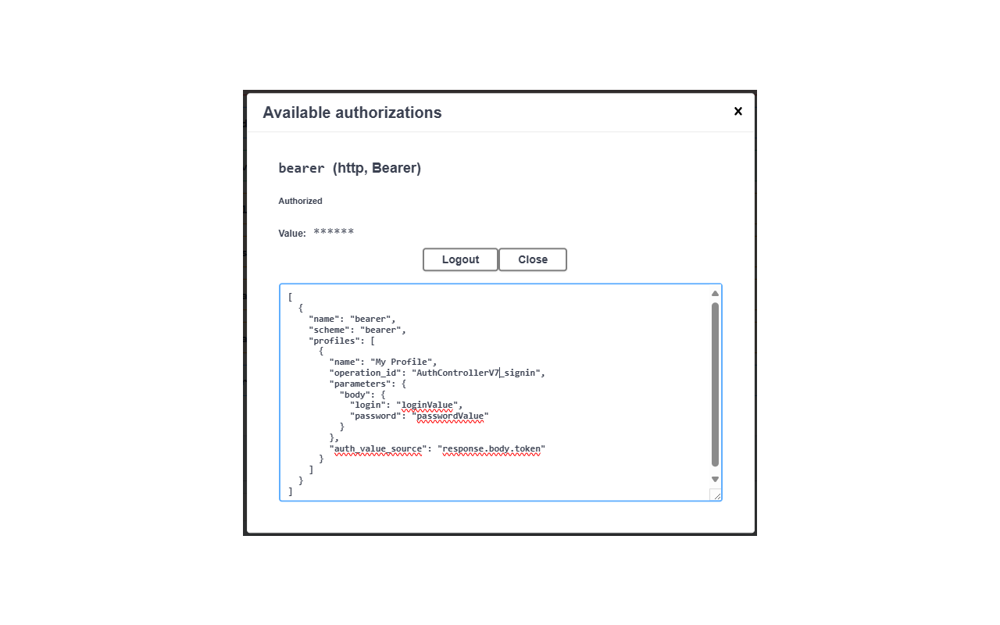
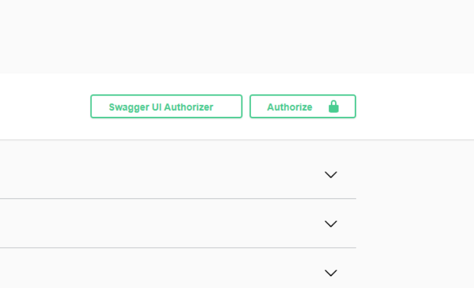
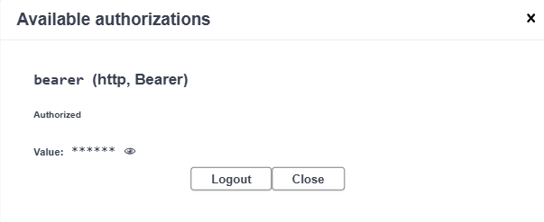

# Swagger UI Authorizer

> **A lightweight browser extension that automatically authorizes your API requests before executing them on Swagger UI pages.**

[](https://chromewebstore.google.com/detail/swagger-ui-authorizer/hhdgdnjkmkhedanhlidcmahodmakepfa)
[](https://github.com/rodewitsch/swagger-ui-authorizer/blob/master/LICENSE)

---

## 📖 About

**Swagger UI Authorizer** is a Chrome browser extension designed to streamline API testing by eliminating the repetitive task of manually pasting authorization tokens. Once configured, the extension automatically handles authorization for every request executed on Swagger UI pages — saving you time and reducing friction in your API workflow.

This repository contains the **official landing page** for the extension, hosted at [swagger-ui-authorizer.rodevich.com](https://swagger-ui-authorizer.rodevich.com).

> The extension source code lives in a [separate repository](https://github.com/rodewitsch/swagger-ui-authorizer).

---

## ✨ Features

- **Multiple Authorization Profiles** — Create, manage, and switch between as many authorization profiles as you need, each tied to a specific security scheme on your API.
- **Token Visibility** — Inspect current authorization token values with a single click — perfect for debugging and verification.
- **OpenAPI 3.x Support** — Fully compatible with OpenAPI 3.x specifications. Works seamlessly with any Swagger UI page that uses the modern spec format.
- **Automatic Pre-Authorization** — Once a profile is active, every API request is automatically authorized before execution — no manual intervention needed.
- **Token TTL Management** — For request-based profiles, tokens are cached with a configurable TTL. Expired tokens are automatically refreshed on the next request.
- **User-Friendly Interface** — Clean, intuitive modal UI that integrates directly into Swagger UI's existing authorization panel.

---

## 🔐 Authorization Methods

| Method | Description |
|---|---|
| **Bearer Token** | Supports both request-based (auto-fetch via API) and static token profiles. |
| **API Key** | Seamlessly handles API key-based authentication via header or query parameter. |
| **HTTP Basic Auth** | Simplifies basic authentication with login/password credential profiles. |

---

## 🖼️ Screenshots

| Profile Management Modal | Flexible Profile Types |
|---|---|
|  |  |

| One-Click Access | Token Visibility |
|---|---|
|  |  |

---

## 🎬 Demo

[](https://www.youtube.com/watch?v=2AeB_kTmQYI)

Watch the full walkthrough on YouTube → [Swagger UI Authorizer Demo](https://www.youtube.com/watch?v=2AeB_kTmQYI)

---

## 🛠️ How It Works

1. **Install** the extension from the [Chrome Web Store](https://chromewebstore.google.com/detail/swagger-ui-authorizer/hhdgdnjkmkhedanhlidcmahodmakepfa).
2. **Refresh** your Swagger UI page — the extension button appears in the toolbar.
3. **Configure** authorization profiles for each security scheme (Bearer Token, API Key, or HTTP Basic Auth).
4. **Execute requests** — the extension automatically authorizes every request before it's sent.

---

## 🔒 Privacy

All authorization tokens, credentials, and profiles are stored **exclusively in your browser's local storage** using the standard `localStorage` API. The extension sends your credentials only to the servers you configure — exactly where they need to go. **No data is ever transmitted to third parties, analytics services, or external servers.**

---

## 👥 Target Audience

- **Developers** — Simplify API testing and debugging by automating authorization workflows.
- **QA Engineers** — Speed up API testing with pre-configured authorization profiles.
- **API Integrators** — Easily switch between multiple APIs and authorization methods during integration.
- **Technical Leads** — Ensure your team can securely and efficiently test APIs without manual token management.
- **OpenAPI Users** — Anyone working with OpenAPI 3.x who wants to save time and reduce repetitive tasks.

---

## 🚀 Installation

### Chrome Web Store

[](https://chromewebstore.google.com/detail/swagger-ui-authorizer/hhdgdnjkmkhedanhlidcmahodmakepfa)

1. Visit the [Chrome Web Store listing](https://chromewebstore.google.com/detail/swagger-ui-authorizer/hhdgdnjkmkhedanhlidcmahodmakepfa).
2. Click **"Add to Chrome"**.
3. Refresh any open Swagger UI pages to activate the extension.

---

## 📁 Project Structure (Landing Page)

```
├── index.html              # Main landing page
├── styles.css              # Stylesheet
├── CNAME                   # Custom domain for GitHub Pages
├── assets/
│   └── images/
│       ├── icons/          # Extension icons & logo
│       └── screenshots/    # Feature screenshots
└── README.md               # This file
```

---

## 📄 License

This project is open source under the [MIT License](https://github.com/rodewitsch/swagger-ui-authorizer/blob/master/LICENSE).

---

## 🔗 Links

- [Chrome Web Store](https://chromewebstore.google.com/detail/swagger-ui-authorizer/hhdgdnjkmkhedanhlidcmahodmakepfa)
- [GitHub Repository (Extension)](https://github.com/rodewitsch/swagger-ui-authorizer)
- [Landing Page](https://swagger-ui-authorizer.rodevich.com)
- [Report an Issue](https://github.com/rodewitsch/swagger-ui-authorizer/issues)
- [Discussions](https://github.com/rodewitsch/swagger-ui-authorizer/discussions)
